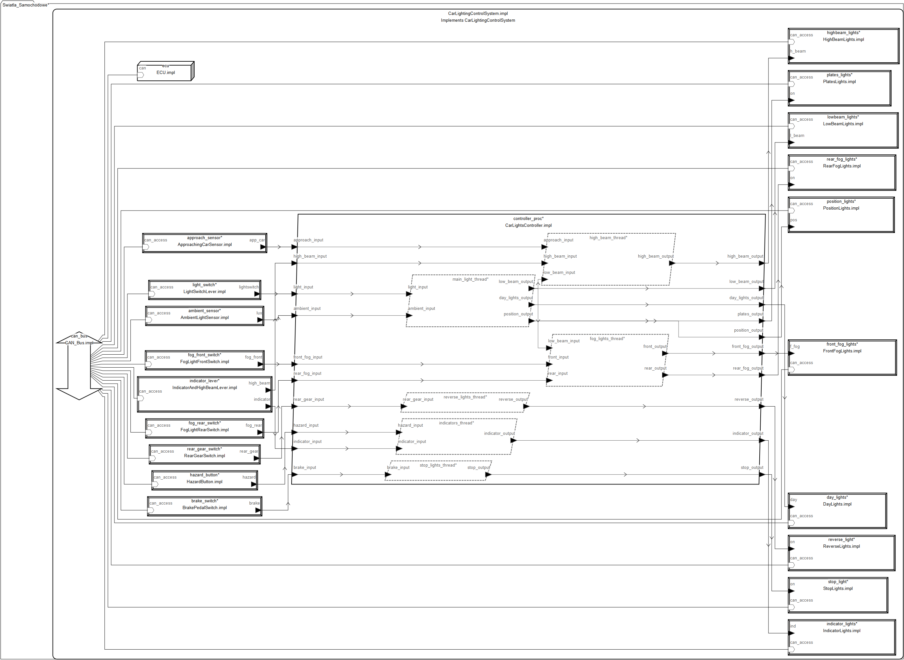
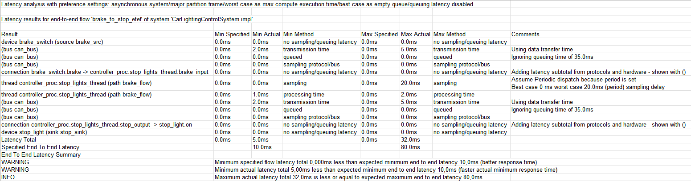
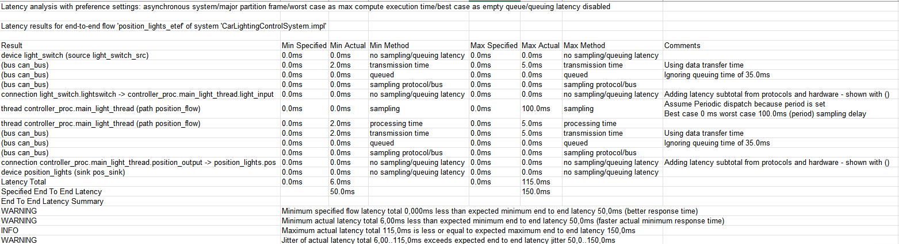
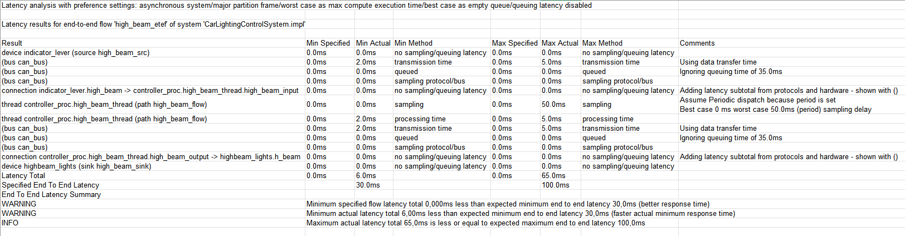
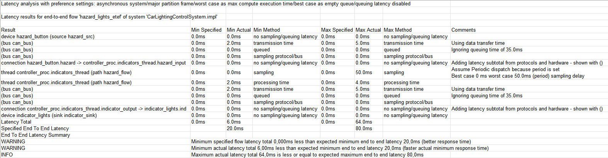

# System sterowania światłami samochodowymi w AADL

Model systemu sterowania oświetleniem pojazdu zaprojektowany w języku Architecture Analysis & Design Language (AADL).

---

## Dane studenta

**Imię i nazwisko:** Szymon Bigaj  
**E-mail:** sbigaj@student.agh.edu.pl  

---

## Opis modelowanego systemu

### Opis ogólny

Model przedstawia System Sterowania Oświetleniem Samochodu zbudowany w środowisku OSATE w języku AADL. System odpowiada za zbieranie danych z urządzeń wejściowych oraz sterowanie urządzeniami wykonawczymi. Składa się z następujących elementów:

- **Urządzeń wejściowych** - przełączniki, dźwignie, czujniki (9 urządzeń)
- **Jednostki sterującej ECU** - procesor przetwarzający sygnały
- **Magistrali CAN** - medium komunikacyjne (500 kbit/s)
- **Logiki sterowania** - 6 niezależnych wątków przetwarzających
- **Urządzeń wyjściowych** - sterowniki świateł (10 typów świateł)

Model implementuje rzeczywistą architekturę systemu świateł pojazdu samochodowego zgodnie ze standardami branżowymi, z podziałem odpowiedzialności na moduły funkcjonalne i uwzględnieniem krytycznych wymagań czasowych.

---

### Opis dla użytkownika

System sterowania oświetleniem zapewnia automatyczne i manualne zarządzanie oświetleniem pojazdu. Kierowca korzysta z przełączników i czujników, a system dokonuje odpowiednich decyzji dotyczących oświetlenia:

System obsługuje następujące funkcje oświetlenia pojazdu:

#### **Oświetlenie zewnętrzne:**

1. **Światła pozycyjne** - włączane dźwignią świateł, sygnalizują obecność pojazdu
2. **Światła mijania (krótkie)** - podstawowe oświetlenie drogi, włączane automatycznie lub ręcznie
3. **Światła drogowe (długie)** - zwiększone oświetlenie z możliwym automatycznym wyłączeniem przy zbliżającym się pojeździe
4. **Światła dzienne (DRL)** - włączane w trybie automatycznym podczas jazdy dziennej
5. **Kierunkowskazy** - sygnalizacja zmiany kierunku (lewy/prawy) lub światła awaryjne
6. **Światła przeciwmgielne przednie** - dodatkowe oświetlenie w mglistych warunkach
7. **Światła przeciwmgielne tylne** - zwiększona widoczność z tyłu w gęstej mgle
8. **Światła STOP** - sygnalizacja hamowania 
9. **Światła cofania** - oświetlenie podczas jazdy wstecz
10. **Oświetlenie tablicy rejestracyjnej** - związane ze światłami pozycyjnymi

#### **Dodatkowe funkcje:**

- **Auto-wyłączanie długich świateł** - gdy czujnik wykryje zbliżający się pojazd
- **Automatyczne światła mijania** - czujnik światła otoczenia (zmierzch/tunel)
- **Priorytet świateł awaryjnych** - przycisk awaryjny przejmuje kontrolę nad kierunkowskazami
- **Logika zależności** - światła przeciwmgielne oraz drogowe działają tylko przy włączonych światłach mijania

---

## Spis komponentów AADL

### **Device (Urządzenia wejściowe)**

Fizyczne urządzenia generujące sygnały wejściowe od użytkownika i czujników:

| Urządzenie | Opis |
|------------|------|
| `LightSwitchLever` | Dźwignia sterująca trybem świateł (OFF/POSITION/LOW_BEAM/AUTO) |
| `AmbientLightSensor` | Czujnik natężenia światła otoczenia - automatyczne włączanie świateł |
| `IndicatorAndHighBeamLever` | Dźwignia kierunkowskazów i długich świateł |
| `FogLightFrontSwitch` | Przełącznik świateł przeciwmgielnych przednich |
| `FogLightRearSwitch` | Przełącznik świateł przeciwmgielnych tylnych |
| `HazardButton` | Przycisk świateł awaryjnych |
| `BrakePedalSwitch` | Czujnik pedału hamulca - wykrywa naciśnięciec |
| `RearGearSwitch` | Czujnik biegu wstecznego |
| `ApproachingCarSensor` | Czujnik zbliżających się pojazdów (radar/kamera) |

**Wspólna cecha:** 
- Każde urządzenie komunikuje się z ECU przez magistralę CAN.
- Każde urządzenie ma zdefiniowany flow source dla analizy przepływów

---

### **Device (Urządzenia wyjściowe)**

Sterowniki i moduły świateł realizujące funkcje oświetleniowe:

| Urządzenie | Opis |
|------------|------|
| `PositionLights` | Światła pozycyjne przednie - sygnalizacja obecności pojazdu |
| `LowBeamLights` | Reflektory mijania - podstawowe oświetlenie drogi |
| `HighBeamLights` | Reflektory drogowe - zwiększone oświetlenie |
| `IndicatorLights` | Kierunkowskazy (4 lampy: lewy/prawy przód/tył) |
| `DayLights` | Światła dzienne LED - widoczność w dzień |
| `FrontFogLights` | Światła przeciwmgielne przednie |
| `StopLights` | Światła hamowania - sygnalizacja zatrzymywania |
| `ReverseLights` | Światła cofania - oświetlenie przy jeździe wstecz |
| `RearFogLights` | Światła przeciwmgielne tylne |
| `PlatesLights` | Oświetlenie tablicy rejestracyjnej - świeci z pozycyjnymi |

**Wspólna cecha:** 
- Każde urządzenie odbiera komendy sterujące z ECU przez magistralę CAN.
- Każde urządzenie ma zdefiniowany flow sink dla analizy przepływów

---

### **Thread (Wątki - logika sterowania)**

Niezależne wątki przetwarzające realizujące logikę biznesową systemu:

| Wątek | Funkcja | Właściwości czasowe |
|-------|---------|---------------------|
| `MainLightControl` | Zarządzanie podstawowym oświetleniem (pozycyjne, mijania, dzienne) | Period: 100ms, Exec: 2-5ms, Deadline: 100ms |
| `HighBeamControl` | Kontrola długich świateł z opcjonalnym automatycznym wyłączaniem przy zbliżającym się pojeździe | Period: 50ms, Exec: 1-3ms, Deadline: 50ms |
| `IndicatorsControl` | Sterowanie kierunkowskazami i światłami awaryjnymi | Period: 50ms, Exec: 1-2ms, Deadline: 50ms |
| `FogLightsControl` | Zarządzanie światłami przeciwmgielnymi (weryfikacja dostępności mijania) | Period: 100ms, Exec: 1-2ms, Deadline: 100ms |
| `StopLightControl` | sterowanie światłami hamowania z minimalnym opóźnieniem | Period: 20ms, Exec: 0.5-1ms, Deadline: 20ms |
| `ReverseLightControl` | Sterowanie światłami cofania | Period: 50ms, Exec: 0.5-1ms, Deadline: 50ms |

**Kluczowe cechy:**
- Każdy wątek ma zdefiniowane flow paths dla analizy przepływów
- Period określa częstotliwość wykonywania wątku
- Exec (Compute_Execution_Time) to rzeczywisty czas przetwarzania
- Deadline określa maksymalny dopuszczalny czas na zakończenie
- StopLightControl ma najwyższy priorytet (najkrótszy Period = 20ms)

---

### **Process (Proces główny)**

| Proces | Opis |
|--------|------|
| `CarLightsController` | Główny proces integrujący wszystkie wątki sterowania. Zawiera porty wejściowe/wyjściowe, zarządza połączeniami między wątkami (np. przekazywanie stanu świateł mijania do kontrolera długich i przeciwmgielnych) oraz implementuje flow paths dla analizy end-to-end. |

**Subkomponenty:**
- 6 wątków: `MainLightControl`, `HighBeamControl`, `IndicatorsControl`, `FogLightsControl`, `StopLightControl`, `ReverseLightControl`

---

### **Processor (Procesor)**

| Procesor | Opis |
|----------|------|
| `ECU` | Electronic Control Unit - jednostka sterująca światłami. Fizyczne urządzenie wykonujące proces CarLightsController. Wszystkie wątki są bindowane do tego procesora. Posiada dostęp do magistrali CAN przez dedykowany port. |

---

### 🚌 **Bus (Magistrala komunikacyjna)**

| Magistrala | Opis |
|------------|------|
| `CAN_Bus` | Controller Area Network - standard komunikacyjny w automotive. Łączy wszystkie urządzenia wejściowe z ECU oraz ECU z urządzeniami wyjściowymi. Prędkość transmisji: 500 kbit/s, rozmiar ramki: 8 bajtów, czas transmisji: 2-5ms. Wszystkie połączenia danych są fizycznie realizowane przez tę magistralę (Actual_Connection_Binding). |

---

### **End-to-End Flows (Przepływy end-to-end)**

Kluczowe ścieżki przepływu danych przez cały system:

| Flow | Ścieżka | Budżet czasu |
|------|---------|--------------|
| `brake_to_stop_etef` | Pedał hamulca → CAN → ECU/StopLightControl → CAN → Światło STOP | 10-80ms |
| `position_lights_etef` | Dźwignia świateł → CAN → ECU/MainLightControl → CAN → Światła pozycyjne | 50-150ms |
| `high_beam_etef` | Dźwignia długich → CAN → ECU/HighBeamControl → CAN → Długie | 30-100ms |
| `hazard_lights_etef` | Przycisk awaryjnych → CAN → ECU/IndicatorsControl → CAN → Kierunkowskazy | 20-80ms |

---

### **System (System główny)**

| System | Opis |
|--------|------|
| `CarLightingControlSystem` | Główny system integrujący wszystkie komponenty modelu. Zawiera procesor ECU, magistralę CAN, 9 urządzeń wejściowych, 10 urządzeń wyjściowych oraz proces CarLightsController. Definiuje wszystkie połączenia danych między urządzeniami a procesorem oraz połączenia magistrali (bus access). Zawiera właściwości bindingu określające, że proces wykonuje się na ECU, a wszystkie połączenia danych przechodzą przez CAN. |

---

## Model - rysunek

Na rysunku przedstawiono diagram modelu systemu sterowania światłami samochodowymi:

---

## Analiza modelu

Model zawiera pełną specyfikację przepływów umożliwiającą analizę pełnego przepływu

### Analiza przepływu pełnego (End-to-End Flows):

Po przez implementację informacji dotyczących przepływu e urządzeniach wejściowych, wątkach oraz urządzeniach wyjściowych przeprowadzono analizę pełnego przepływu dla czterech wybranych ścieżek przepływu danych:
* **Ścieżka od hamulca do światła stopu** - Pedał hamulca → CAN → ECU/StopLightControl → CAN → Światło STOP - Oczekiwany czas: 10-80ms
* **Ścieżka załączenia świateł pozycyjnych** - Dźwignia świateł → CAN → ECU/MainLightControl → CAN → Światła pozycyjne - Oczekiwany czas: 50-150ms
* **Ścieżka załączenia świateł drogowych** - Dźwignia długich → CAN → ECU/HighBeamControl → CAN → Długie - Oczekiwany czas: 30-100ms
* **Ścieżka załączenia świateł awaryjnych** - Przycisk awaryjnych → CAN → ECU/IndicatorsControl → CAN → Kierunkowskazy - Oczekiwany czas: 20-80ms

Ustawienia analizy przepływu danych:
- typ systemu: asynchroniczny
- najgorszy czas przetwarzania: maksymalny czaas wykonania obliczeń
- czas kolejkowania: wyłączony

### Wyniki przeprowadzonych analiz

Ścieżka od hamulca do światła stopu:

Ścieżka załączenia świateł pozycyjnych:

Ścieżka załączenia świateł drogowych

Ścieżka załączenia świateł awaryjnych

### Wnioski

* Wszystkie cztery ścieżki spełniają założone maksymalne czasy opóźnień, co potwierdza zgodność modelu z wymaganiami funkcjonalnymi systemu oświetlenia samochodowego.

* W trzech ścieżkach (STOP, drogowe, awaryjne) brak jest odchyleń, które mogłyby wskazywać na ryzyko naruszenia wymagań czasowych.

* Jedynym elementem wymagającym uwagi jest jitter w ścieżce świateł pozycyjnych, gdzie zbyt niski minimalny czas reakcji prowadzi do przekroczenia zdefiniowanego zakresu zmienności. Może to sugerować potrzebę doprecyzowania założeń projektowych lub optymalizacji harmonogramu przetwarzania w ECU.
  
---

## Inne informacje zależne od tematu

---

## Literatura

- SAE International, "AS5506C: Architecture Analysis & Design Language (AADL)," SAE International Standard, 2017. Available: https://www.sae.org/standards/content/as5506c/
  
- P. H. Feiler and D. P. Gluch, Model-Based Engineering with AADL: An Introduction to the SAE Architecture Analysis & Design Language, Addison-Wesley Professional, 2012. ISBN: 978-0321888945

- OSATE 2 - Open Source AADL Tool Environment. Available: https://osate.org/

